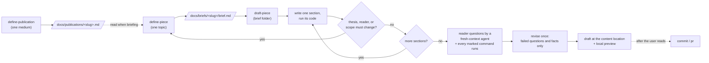
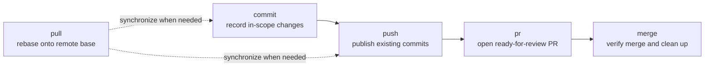

# Skills

[](https://skills.sh/toy-crane/skills)

A composable, model-agnostic set of skills for product definition, shaping,
prototyping, task splitting, implementation, runtime verification, human
review, project knowledge, verified follow-up resolution, test-first
development, writing publications and pieces, project skill updates with
cross-client custom-agent synchronization, and safe Git delivery. Install selected skills or the complete plugin.

## Install

Choose copy-in installation or the managed plugin.

### skills.sh (copy into your project)

Copies selected skill folders into your project for local editing.

```bash
npx skills@latest add toy-crane/skills
```

Choose the skills and coding agents to install.

If an existing copy was installed before the source catalog moved into the
`git`, `workflow`, and `expo` groups, run the add command once more instead of
relying on `skills update`. The CLI tracks the exact upstream skill path, while
the reinstallation keeps the same skill names and refreshes that path.
`update-project-skills` reports such entries instead of reinstalling them.

The product-context workflow replaces `discover-opportunity` with
`define-product` and renames `compact-decisions` to
`maintain-project-context`. A copy-in installation does not receive aliases for
the retired names; remove those old copied folders after installing the
replacements.

### Project update (installed skills + companion agents)

Install `update-project-skills` once, then invoke it whenever a project should
follow the latest published skills:

```bash
npx -y skills@latest add toy-crane/skills \
  --skill update-project-skills \
  --agent codex claude-code \
  -y
```

Use `/update-project-skills` in Claude Code or `$update-project-skills` in
Codex. It updates every skill recorded in `skills-lock.json` through
`skills update`, whatever its source, then reconciles the Toycrane set:
installs newly published skills that apply to the project's stack, retires
unpublished managed skills, and materializes any companion custom agents into
both `.claude/agents/` and `.codex/agents/`. Third-party skills are refreshed in
place only, and the locks preserve project-owned skills and agents unless the
user explicitly approves adopting a colliding name.

This is the cross-client installation path for companion agents. A skill folder
can carry their source payload, but neither client discovers that nested payload
as a native custom agent on its own.

### Claude Code plugin (managed bundle)

Installs the complete set as a read-only bundle. Updates arrive with new plugin
versions.

Inside Claude Code:

```
/plugin marketplace add toy-crane/skills
/plugin install toycrane-skills@toycrane
```

Or from your shell:

```bash
claude plugin marketplace add toy-crane/skills
claude plugin install toycrane-skills@toycrane
```

The plugin installs the managed skill bundle for Claude Code. Run the
project-local sync workflow above when the same project also needs companion
agents in Claude Code and Codex.

## The pipeline

Six skills cover product definition through implementation.

```mermaid
flowchart LR
    DP["define-product<br/>(rough direction known)"] --> READY{"whole direction clear<br/>without guessing?"}
    READY -- "no" --> ASK["ask about real use<br/>(no guessed answers)"]
    ASK --> READY
    READY -- "yes" --> REQUEST{"writing already<br/>requested?"}
    REQUEST -- "yes" --> PRODUCT[/PRODUCT.md/]
    REQUEST -- "no" --> DRAFT["show the whole direction"]
    DRAFT --> CONFIRM{"confirmed?"}
    CONFIRM -- "not yet" --> ASK
    CONFIRM -- "yes" --> PRODUCT
    PRODUCT -. "read when present" .-> SI["shape-idea<br/>(one work unit)"]
    SI --> BP["build-prototype<br/>(judge it by using it)"]
    SI --> SPEC[/spec folder/]
    BP --> SPEC
    SPEC --> ST["split-into-tasks<br/>(shallow outcome map)"]
    SPEC --> IM["implement<br/>(spec folder)"]
    ST --> IM
    IM --> ONE["build one outcome"]
    ONE --> CHECK["check real behavior"]
    CHECK --> MATCH{"still matches the spec<br/>and remaining tasks?"}
    MATCH -- "technical facts changed" --> UPDATE["update active tasks"]
    UPDATE --> ONE
    MATCH -- "work-unit promise changed" --> SI
    MATCH -- "app premise changed" --> DP
    MATCH -- "yes" --> MORE{"more outcomes?"}
    MORE -- "yes" --> ONE
    MORE -- "no" --> FINAL["full checks + changed/core loop<br/>+ one code review pass"]
    FINAL --> TRIAGE{"breaks a criterion or<br/>reproduces as a defect?"}
    TRIAGE -- "yes" --> FIX["repair, recheck<br/>(no second review)"]
    FIX --> DONE["verified and runnable,<br/>with the review as evidence"]
    TRIAGE -- "no" --> REC["record: follow-up,<br/>note, or user decision"]
    REC --> DONE
    IM -. "uses at pre-agreed public seams" .-> TDD[tdd]
    IM -. "proves affected surfaces" .-> RV["matching runtime skill<br/>or strongest usable path"]
    IM -. "open workaround or<br/>out-of-scope defect" .-> FU["follow-up"]
```



Invoke `define-product` when starting a from-scratch app whose rough direction
or problem is already known. It starts from a concrete use scene and draws out
the user's product meaning instead of filling gaps from the initial solution
idea. After the complete direction is confirmed, it creates or revises root
`PRODUCT.md` with the users and situations, problem and alternatives, promised
change, core loop, capabilities and boundaries, experience principles, success
signals, assumptions, and unknowns. Blank-page idea discovery is outside this
workflow.

Start with `shape-idea` when one concrete problem and broad work-unit direction
are already known. It reads `PRODUCT.md` when present but remains independently
usable when the file is absent, and it neither creates nor edits app-level
product context.

`shape-idea` records one stable product contract in
`docs/specs/<slug>/spec.md`: user-visible outcomes, scope, observable acceptance
criteria, settled constraints and rationale, assumptions, off-limits areas and
reasons, deferrals, and risks. `build-prototype` can start from the current
conversation alone; when a whole interface is approved and consequential
non-visual behavior is settled or explicitly deferred, it creates or updates
that same contract and preserves `prototype.html` beside it. Use
`split-into-tasks` only
when the spec contains outcomes that should be delivered separately. It also
creates the complete shallow outcome map without predicting files, functions,
code structure, or a step-by-step implementation sequence. It marks only the
few intermediate reviews justified by material or downstream risk.

Then pass the spec folder to `implement`. Before each outcome, it reloads the
current spec, active unfinished tasks, and any completed or superseded task
implicated by current evidence, plus code, Git state, and verification evidence,
then plans only that outcome in detail. After focused verification, it checks
the observed result against the product contract and every active unfinished
task. It may update technical assumptions and affected active tasks when the
approved product behavior stays the same. If an approved outcome, observable
acceptance criterion, scope, or other product constraint must change, it stops
and returns that exact decision to shaping. A task marked `completed` is
reopened if later evidence shows its criteria no longer pass. When an approved
breakdown replaces historically completed work, its still-required obligations
move to the replacement; the old task remains only as inactive `superseded`
evidence and cannot block or re-enter the delivery frontier.

After every outcome passes that check, the current harness's automated
code-review process reads the integrated result once against the selected spec
and acceptance criteria. `implement` picks the depth that change warrants, and
its findings are triaged rather than looped: `implement` repairs only what
breaks an approved acceptance criterion or reproduces as a defect on an
ordinary path, then records the rest as follow-ups, disposed trade-offs, or
decisions the user owns. The review is evidence attached to the handoff, so a
reviewer that is unavailable, user-only, or silent does not turn verified work
into unfinished work. When the repository exposes the result through a
user-reviewable local server, `implement` verifies the changed surface and
shares an address while leaving that server available until the user finishes
review or later delivery cleanup. `implement` uses `tdd` where behavior can be
verified through pre-agreed public seams. For an affected product surface, it
uses an available matching runtime-verification skill. When none is available,
it autonomously investigates the repository and current environment and builds
the strongest usable runtime path instead of asking the user to approve the
method. After focused checks, it re-verifies the changed flow and the
`PRODUCT.md` core loop on every claimed platform; missing core-loop coverage is
reported rather than invented. If a review repair changes executable behavior,
it repeats that runtime gate on the repaired revision without a second review.
Current-scope gaps stay in implementation. A workaround with an open root cause
or an evidenced out-of-scope defect becomes a durable follow-up.

Pass the folder itself, not an individual spec or task file.

Claude Code:

```text
/implement docs/specs/checkout/
```

Codex:

```text
$implement docs/specs/checkout/
```

The handoff lives at one stable path:

```text
docs/specs/checkout/
├── spec.md
├── prototype.html      # optional
└── tasks/              # optional approved task files
```

Invoke the same folder again after an interruption. `implement` reconstructs
progress from the folder, Git, the current diff, and verification results; a
new session or a closing-message handoff is not required for correctness.

- **[define-product](./skills/workflow/define-product/SKILL.md)**: Draw out the
  product meaning behind a rough app direction, confirm it with the user, and
  preserve it in one current root `PRODUCT.md`. Keep app-level users, problem,
  promise, core loop, boundaries, experience principles, success signals,
  assumptions, and unknowns available across later work units without
  absorbing technical or feature-level detail.
- **[shape-idea](./skills/workflow/shape-idea/SKILL.md)**: Clarify a chosen problem and
  direction through correctable drafts, project evidence, and rendered UI
  variants. Maintain project terms and write the stable product contract that
  later task splitting and implementation must preserve.
- **[build-prototype](./skills/workflow/build-prototype/SKILL.md)**: Build every screen in
  one dummy-data HTML file using the project's design system, or the shell's
  minimal style when none exists. Review the rendered screens and preserve the
  approved prototype beside the same product contract used by shaping.
- **[split-into-tasks](./skills/workflow/split-into-tasks/SKILL.md)**: Split an existing
  spec into the complete shallow map of the fewest approved, independently
  deliverable vertical tasks, without predicting code-level implementation.
  Include explicit blockers, acceptance criteria, focused verification, minimal
  state, and only risk-justified intermediate review checkpoints, each one
  bounded review pass.
  Adapted from [mattpocock/skills](https://github.com/mattpocock/skills) (MIT).
- **[implement](./skills/workflow/implement/SKILL.md)**: Implement an approved spec
  folder one outcome at a time. Reload repository evidence before each outcome,
  reconcile verified behavior with the product contract and active unfinished
  tasks, ignore superseded history unless current evidence implicates it, reopen
  invalidated work, and return to shaping when a product decision must change.
  Then finish with full verification, one triaged automated code-review pass,
  and a verified runnable product address when the repository provides one.
- **[tdd](./skills/workflow/tdd/SKILL.md)**: Implement one red → green slice at a time at
  pre-agreed public seams. Includes rules for stable seams and behavioral tests.
  Adapted from
  [mattpocock/skills](https://github.com/mattpocock/skills) (MIT).

## The writing pipeline

Three skills carry the same premise → brief → draft structure over to prose,
for a publication that lives in the same repository as its code, such as a
product blog inside a monorepo. They share `GLOSSARY.md`,
`docs/decisions/README.md`, and `project-knowledge` with the code pipeline, so
a piece about the product uses the product's own terms.



Skill bodies are medium-neutral. Everything that differs by medium, such as
form, length, where finished pieces live, how they are previewed, and what
evidences a finished piece, lives in the publication file, so a newsletter or
brand site later adds a file rather than a skill.

- **[define-publication](./skills/writing/define-publication/SKILL.md)**: Interview
  the user about one medium's readers, promised change, voice, coverage,
  conventions, and evidence, then preserve the confirmed premise in
  `docs/publications/<slug>.md`, one file per medium.
- **[define-piece](./skills/writing/define-piece/SKILL.md)**: Turn one topic into a
  confirmed brief through correctable candidates: thesis, titles, outline,
  three to five checkable reader questions, scope, material, and which code is
  execution-checked. Writes no body prose.
- **[draft-piece](./skills/writing/draft-piece/SKILL.md)**: Write the piece from its
  brief folder section by section, running embedded code as it is written.
  Verify with a fresh-context agent answering the reader questions and with
  every marked command, revise once, preview locally, and stop before commit.

Claude Code:

```text
/draft-piece docs/briefs/monorepo-move/
```

Codex:

```text
$draft-piece docs/briefs/monorepo-move/
```

## Git delivery

Five standalone skills cover the repository handoff from a local change to a
merged base branch. Invoke them directly with `/commit`, `/pull`, `/push`,
`/pr`, or `/merge` in Claude Code and `$commit`, `$pull`, `$push`, `$pr`, or
`$merge` in Codex.

When Codex exposes the managed plugin namespace, or a user-level skill with the
same short name is also installed, use `$toycrane-skills:commit`,
`$toycrane-skills:pull`, `$toycrane-skills:push`, `$toycrane-skills:pr`, or
`$toycrane-skills:merge` to select this bundle unambiguously.



Each skill is independently installable and owns its whole advertised outcome.
`push` deliberately leaves dirty changes local. `pr` may perform the necessary
commit, synchronization, and publication, but stops before merge. `merge`
continues through verified remote merge and cleans up only resources owned by
the merged worktree.

- **[commit](./skills/git/commit/SKILL.md)**: Record only the current request's
  changes as logical Conventional Commits while preserving unrelated work.
- **[pull](./skills/git/pull/SKILL.md)**: Rebase the current checkout onto the fetched
  requested base, or remote default, without treating a dirty tree as permission
  to modify local work.
- **[push](./skills/git/push/SKILL.md)**: Publish existing commits on a named branch,
  reconciling remote state and using lease protection for intentional rewrites.
- **[pr](./skills/git/pr/SKILL.md)**: Turn the current change into a ready-for-review
  GitHub pull request and return its URL without merging it.
- **[merge](./skills/git/merge/SKILL.md)**: Carry a change through verified pull
  request merge, choose squash or rebase by commit meaning, then safely clean up
  the merged worktree and its owned development server.

## Supporting workflows

Nine additional skills can run independently. They handle stack setup, Expo
runtime verification, pre-delivery both-platform checks, cross-client skill and
agent synchronization, incremental project knowledge, verified follow-up
resolution, visual explanation, final human judgment, and periodic context
maintenance. `implement` also uses a matching runtime-verification skill when
one is available for an affected product surface.

- **[add-stack-context](./skills/workflow/add-stack-context/SKILL.md)**: Audit the
  technologies that define a project's stack, discover vendor-controlled skills,
  keep changing official guidance live, and surface community skills for
  approval. Runs during agent setup, after stack changes, or on entering an
  unaudited project.
- **[expo-dev-loop](./skills/expo/expo-dev-loop/SKILL.md)**: Verify Expo and React
  Native changes in a running app with `agent-device`, first proving target
  readiness and the scenario's required state, then selecting Metro reload or
  native rebuild and completing only with device evidence.
- **[expo-smoke-test](./skills/expo/expo-smoke-test/SKILL.md)**: Before delivery,
  prepare a known-app, fresh-device, or preserved-prior state as the scenario
  requires, then drive the current change and the `PRODUCT.md` core loop on iOS
  and Android development builds through one isolated `expo-smoke-runner` per
  platform.
- **[update-project-skills](./skills/workflow/update-project-skills/SKILL.md)**:
  Update every skill installed in the project to its latest published version
  with `skills.sh`, reconcile the Toycrane set, and install, refresh, or retire
  its project-local companion agents for both Claude Code and Codex without
  taking ownership of unrelated artifacts.
- **[project-knowledge](./skills/workflow/project-knowledge/SKILL.md)**: Maintain project
  terms and settled decisions that future work should reuse whenever they are
  taking shape, including while a plan weighs alternatives. Does not run for
  lookup, routine implementation details, or execution of settled decisions.
- **[resolve-follow-ups](./skills/workflow/resolve-follow-ups/SKILL.md)**: Sweep
  evidence-backed `docs/follow-ups/` items in bounded batches, reproduce each
  symptom before editing, and publish verified fixes as independent
  worktree-isolated pull requests without automatic merge.
- **[explain-visually](./skills/workflow/explain-visually/SKILL.md)**: Render explanations
  with the best available tool. Use one sentence instead when one sentence fully
  answers the question.
- **[human-review](./skills/workflow/human-review/SKILL.md)**: Turn a completed, substantial
  or consequential repository change into a minimal visual handoff when the user
  asks to inspect actual outcomes and judge unresolved commitments. Show the
  whole outcome, then focus one review set on at most three active questions.
- **[maintain-project-context](./skills/workflow/maintain-project-context/SKILL.md)**:
  Periodically reconcile `PRODUCT.md`, the glossary, decision contracts, shipped
  specs, and agent instructions after work accumulates. Apply only meaning that
  is already settled and leave ambiguous conflicts for explicit clarification.

## Output styles

- **[natural-korean](./output-styles/natural-korean.md)**: A Claude Code
  response style for natural, spoken-register Korean instead of
  translated-sounding Korean. Ships with the Claude Code plugin only —
  skills.sh copies skill folders, not output styles. Select it with
  `/output-style` after installing the plugin.

## Acknowledgements

The skill-writing philosophy behind this project is deeply inspired by
[Matt Pocock](https://github.com/mattpocock)'s work—especially his approach to
making stochastic systems more predictable through clear, compact, and
checkable instructions. Thank you to Matt for articulating and openly sharing
these ideas through [mattpocock/skills](https://github.com/mattpocock/skills).

## License

MIT. See [LICENSE](./LICENSE).
