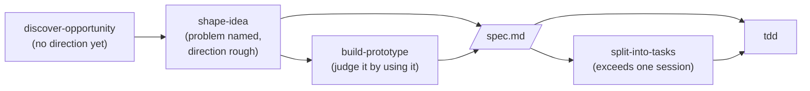

# Skills

[](https://skills.sh/toy-crane/skills)

A composable, model-agnostic set of skills for product discovery, shaping,
prototyping, task splitting, project knowledge, and test-first implementation.
Install selected skills or the complete plugin.

## Install

Choose copy-in installation or the managed plugin.

### skills.sh (copy into your project)

Copies selected skill folders into your project for local editing.

```bash
npx skills@latest add toy-crane/skills
```

Choose the skills and coding agents to install.

### Claude Code plugin (managed bundle)

Installs the complete set as a read-only bundle. Updates arrive with new plugin
versions.

Inside Claude Code:

```
/plugin marketplace add toy-crane/skills
/plugin install toycrane-skills@toycrane
```

Or from your shell:

```bash
claude plugin marketplace add toy-crane/skills
claude plugin install toycrane-skills@toycrane
```

## The pipeline

Five skills cover discovery through implementation.



Invoke `discover-opportunity` when no problem or direction is known. It runs only
on `/discover-opportunity` in Claude Code or `$discover-opportunity` in Codex.
Start with `shape-idea` when the problem and a broad direction are already known.
The discovery handoff remains in the conversation rather than a separate file.

`shape-idea` records implementation-ready decisions in
`docs/specs/<slug>/spec.md`. `build-prototype` adds `prototype.html` when a whole
interface needs review. Use `split-into-tasks` only when the work exceeds one
session; otherwise implement directly from the spec. Implementation planning is
just in time, and `tdd` provides the implementation loop.

- **[discover-opportunity](./skills/discover-opportunity/SKILL.md)**: Find
  side-project directions from agreed personal traces and relevant current
  change. Runs only when explicitly invoked and hands the chosen direction to
  `shape-idea` without creating a document.
- **[shape-idea](./skills/shape-idea/SKILL.md)**: Clarify a chosen problem and
  direction through correctable drafts, project evidence, and rendered UI
  variants. Maintains project terms, records only human-approved durable
  project decisions, then writes an implementation-ready spec.
- **[build-prototype](./skills/build-prototype/SKILL.md)**: Build every screen in
  one dummy-data HTML file using the project's design system, or the shell's
  minimal style when none exists. Review the rendered screens and preserve the
  approved prototype beside the spec.
- **[split-into-tasks](./skills/split-into-tasks/SKILL.md)**: Split an existing
  spec into approved, session-sized vertical tasks with explicit blockers and
  acceptance criteria. Run each task in a fresh session.
  Adapted from [mattpocock/skills](https://github.com/mattpocock/skills) (MIT).
- **[tdd](./skills/tdd/SKILL.md)**: Implement one red → green slice at a time at
  pre-agreed public seams. Includes rules for stable seams and behavioral tests.
  Adapted from
  [mattpocock/skills](https://github.com/mattpocock/skills) (MIT).

## Outside the pipeline

Four additional skills run independently of the pipeline. Two are user-invoked,
one runs in the background, and one runs when the user asks for an explanation.

- **[add-stack-context](./skills/add-stack-context/SKILL.md)**: Install each
  framework or service vendor's official agent context in its recommended form.
  User-invoked for project setup.
- **[knowledge-layer](./skills/knowledge-layer/SKILL.md)**: Maintain project
  terms and human-approved current decision contracts whenever they are taking
  shape, including while a plan weighs alternatives. Does not run for lookup,
  routine AI defaults, or execution of settled decisions.
- **[explain-visually](./skills/explain-visually/SKILL.md)**: Render explanations
  with the best available tool. Use one sentence instead when one sentence fully
  answers the question.
- **[compact-decisions](./skills/compact-decisions/SKILL.md)**: Reconcile current
  decision contracts, the glossary, spec folders, and always-loaded instructions
  after work ships. Compact wording without changing human-approved meaning.

## License

MIT. See [LICENSE](./LICENSE).
