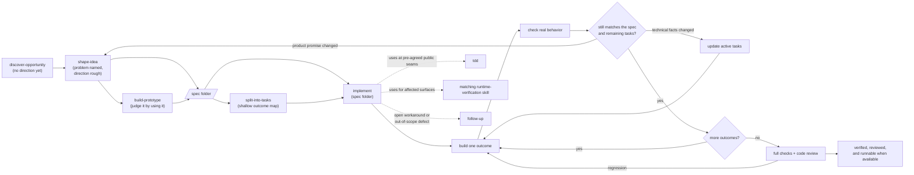
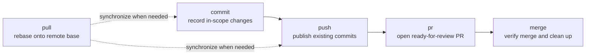

# Skills

[](https://skills.sh/toy-crane/skills)

A composable, model-agnostic set of skills for product discovery, shaping,
prototyping, task splitting, implementation, runtime verification, human
review, project knowledge, verified follow-up resolution, test-first
development, and safe Git delivery. Install selected skills or the complete
plugin.

## Install

Choose copy-in installation or the managed plugin.

### skills.sh (copy into your project)

Copies selected skill folders into your project for local editing.

```bash
npx skills@latest add toy-crane/skills
```

Choose the skills and coding agents to install.

If an existing copy was installed before the source catalog moved into the
`git`, `workflow`, and `expo` groups, run the add command once more instead of
relying on `skills update`. The CLI tracks the exact upstream skill path, while
the reinstallation keeps the same skill names and refreshes that path.

### Claude Code plugin (managed bundle)

Installs the complete set as a read-only bundle. Updates arrive with new plugin
versions.

Inside Claude Code:

```
/plugin marketplace add toy-crane/skills
/plugin install toycrane-skills@toycrane
```

Or from your shell:

```bash
claude plugin marketplace add toy-crane/skills
claude plugin install toycrane-skills@toycrane
```

## The pipeline

Six skills cover discovery through implementation.



Invoke `discover-opportunity` when no problem or direction is known. It runs only
on `/discover-opportunity` in Claude Code or `$discover-opportunity` in Codex.
Start with `shape-idea` when the problem and a broad direction are already known.
The discovery handoff remains in the conversation rather than a separate file.

`shape-idea` records one stable product contract in
`docs/specs/<slug>/spec.md`: user-visible outcomes, scope, observable acceptance
criteria, settled constraints and rationale, assumptions, off-limits areas and
reasons, deferrals, and risks. `build-prototype` can start from the current
conversation alone; when a whole interface is approved and consequential
non-visual behavior is settled or explicitly deferred, it creates or updates
that same contract and preserves `prototype.html` beside it. Use
`split-into-tasks` only
when the spec contains outcomes that should be delivered separately. It also
creates the complete shallow outcome map without predicting files, functions,
code structure, or a step-by-step implementation sequence. It marks only the
few intermediate reviews justified by material or downstream risk.

Then pass the spec folder to `implement`. Before each outcome, it reloads the
current spec, active unfinished tasks, and any completed or superseded task
implicated by current evidence, plus code, Git state, and verification evidence,
then plans only that outcome in detail. After focused verification, it checks
the observed result against the product contract and every active unfinished
task. It may update technical assumptions and affected active tasks when the
approved product behavior stays the same. If an approved outcome, observable
acceptance criterion, scope, or other product constraint must change, it stops
and returns that exact decision to shaping. A task marked `completed` is
reopened if later evidence shows its criteria no longer pass. When an approved
breakdown replaces historically completed work, its still-required obligations
move to the replacement; the old task remains only as inactive `superseded`
evidence and cannot block or re-enter the delivery frontier.

After every outcome passes that check, the current harness's automated
code-review process checks the integrated result against the selected spec and
acceptance criteria. When the repository exposes the result through a
user-reviewable local server, `implement` verifies the changed surface and
shares an address while leaving that server available until the user finishes
review or later delivery cleanup. `implement` uses `tdd` where behavior can be
verified through pre-agreed public seams. For an affected product surface, it
also uses an available matching runtime-verification skill, or verifies the
changed behavior through the repository's supported runtime when none is
available. Current-scope gaps stay in implementation. A workaround with an open
root cause or an evidenced out-of-scope defect becomes a durable follow-up.

Pass the folder itself, not an individual spec or task file.

Claude Code:

```text
/implement docs/specs/checkout/
```

Codex:

```text
$implement docs/specs/checkout/
```

The handoff lives at one stable path:

```text
docs/specs/checkout/
├── spec.md
├── prototype.html      # optional
└── tasks/              # optional approved task files
```

Invoke the same folder again after an interruption. `implement` reconstructs
progress from the folder, Git, the current diff, and verification results; a
new session or a closing-message handoff is not required for correctness.

- **[discover-opportunity](./skills/workflow/discover-opportunity/SKILL.md)**: Find
  side-project directions from agreed personal traces and relevant current
  change. Runs only when explicitly invoked and hands the chosen direction to
  `shape-idea` without creating a document.
- **[shape-idea](./skills/workflow/shape-idea/SKILL.md)**: Clarify a chosen problem and
  direction through correctable drafts, project evidence, and rendered UI
  variants. Maintain project terms and write the stable product contract that
  later task splitting and implementation must preserve.
- **[build-prototype](./skills/workflow/build-prototype/SKILL.md)**: Build every screen in
  one dummy-data HTML file using the project's design system, or the shell's
  minimal style when none exists. Review the rendered screens and preserve the
  approved prototype beside the same product contract used by shaping.
- **[split-into-tasks](./skills/workflow/split-into-tasks/SKILL.md)**: Split an existing
  spec into the complete shallow map of the fewest approved, independently
  deliverable vertical tasks, without predicting code-level implementation.
  Include explicit blockers, acceptance criteria, focused verification, minimal
  state, and only risk-justified intermediate review checkpoints.
  Adapted from [mattpocock/skills](https://github.com/mattpocock/skills) (MIT).
- **[implement](./skills/workflow/implement/SKILL.md)**: Implement an approved spec
  folder one outcome at a time. Reload repository evidence before each outcome,
  reconcile verified behavior with the product contract and active unfinished
  tasks, ignore superseded history unless current evidence implicates it, reopen
  invalidated work, and return to shaping when a product decision must change.
  Then finish with full verification, automated code review, and a verified
  runnable product address when the repository provides one.
- **[tdd](./skills/workflow/tdd/SKILL.md)**: Implement one red → green slice at a time at
  pre-agreed public seams. Includes rules for stable seams and behavioral tests.
  Adapted from
  [mattpocock/skills](https://github.com/mattpocock/skills) (MIT).

## Git delivery

Five standalone skills cover the repository handoff from a local change to a
merged base branch. Invoke them directly with `/commit`, `/pull`, `/push`,
`/pr`, or `/merge` in Claude Code and `$commit`, `$pull`, `$push`, `$pr`, or
`$merge` in Codex.

When Codex exposes the managed plugin namespace, or a user-level skill with the
same short name is also installed, use `$toycrane-skills:commit`,
`$toycrane-skills:pull`, `$toycrane-skills:push`, `$toycrane-skills:pr`, or
`$toycrane-skills:merge` to select this bundle unambiguously.



Each skill is independently installable and owns its whole advertised outcome.
`push` deliberately leaves dirty changes local. `pr` may perform the necessary
commit, synchronization, and publication, but stops before merge. `merge`
continues through verified remote merge and cleans up only resources owned by
the merged worktree.

- **[commit](./skills/git/commit/SKILL.md)**: Record only the current request's
  changes as logical Conventional Commits while preserving unrelated work.
- **[pull](./skills/git/pull/SKILL.md)**: Rebase the current checkout onto the fetched
  requested base, or remote default, without treating a dirty tree as permission
  to modify local work.
- **[push](./skills/git/push/SKILL.md)**: Publish existing commits on a named branch,
  reconciling remote state and using lease protection for intentional rewrites.
- **[pr](./skills/git/pr/SKILL.md)**: Turn the current change into a ready-for-review
  GitHub pull request and return its URL without merging it.
- **[merge](./skills/git/merge/SKILL.md)**: Carry a change through verified pull
  request merge, choose squash or rebase by commit meaning, then safely clean up
  the merged worktree and its owned development server.

## Supporting workflows

Seven additional skills can run independently. They handle stack setup, Expo
runtime verification, project knowledge, verified follow-up resolution, visual
explanation, final human judgment, and periodic cleanup. `implement` also uses
a matching runtime-verification skill when one is available for an affected
product surface.

- **[add-stack-context](./skills/workflow/add-stack-context/SKILL.md)**: Audit the
  technologies that define a project's stack and install each vendor's official
  agent context in its recommended form. Runs during agent setup, after stack
  changes, or on entering an unaudited project.
- **[expo-dev-loop](./skills/expo/expo-dev-loop/SKILL.md)**: Verify Expo and React
  Native changes in a running app with Argent, selecting Metro reload or
  native rebuild from the actual change and completing only with device evidence.
- **[project-knowledge](./skills/workflow/project-knowledge/SKILL.md)**: Maintain project
  terms and settled decisions that future work should reuse whenever they are
  taking shape, including while a plan weighs alternatives. Does not run for
  lookup, routine implementation details, or execution of settled decisions.
- **[resolve-follow-ups](./skills/workflow/resolve-follow-ups/SKILL.md)**: Sweep
  evidence-backed `docs/follow-ups/` items in bounded batches, reproduce each
  symptom before editing, and publish verified fixes as independent
  worktree-isolated pull requests without automatic merge.
- **[explain-visually](./skills/workflow/explain-visually/SKILL.md)**: Render explanations
  with the best available tool. Use one sentence instead when one sentence fully
  answers the question.
- **[human-review](./skills/workflow/human-review/SKILL.md)**: Turn a completed, substantial
  or consequential repository change into a minimal visual handoff when the user
  asks to inspect actual outcomes and judge unresolved commitments. Show the
  whole outcome, then focus one review set on at most three active questions.
- **[compact-decisions](./skills/workflow/compact-decisions/SKILL.md)**: Periodically clean
  up decision files, the glossary, shipped specs, and agent instructions after
  work accumulates. Shorten the documents without changing confirmed decisions.

## Acknowledgements

The skill-writing philosophy behind this project is deeply inspired by
[Matt Pocock](https://github.com/mattpocock)'s work—especially his approach to
making stochastic systems more predictable through clear, compact, and
checkable instructions. Thank you to Matt for articulating and openly sharing
these ideas through [mattpocock/skills](https://github.com/mattpocock/skills).

## License

MIT. See [LICENSE](./LICENSE).
