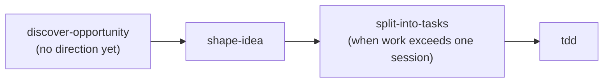

# Skills

[](https://skills.sh/toy-crane/skills)

Agent skills for discovering opportunities, sharpening plans, screens, and
domain models, then implementing them test-first. Small, composable, and
model-agnostic: install the ones you want and make them your own.

## Install

Two ways, two philosophies.

### skills.sh (copy into your project)

Copies the skill files into your project so you can hack on them.

```bash
npx skills@latest add toy-crane/skills
```

Pick the skills and the coding agents you want to install them on.

### Claude Code plugin (managed bundle)

Installs the whole set as a read-only bundle that updates when a new version
ships; you subscribe rather than fork.

Inside Claude Code:

```
/plugin marketplace add toy-crane/skills
/plugin install toycrane-skills@toycrane
```

Or from your shell:

```bash
claude plugin marketplace add toy-crane/skills
claude plugin install toycrane-skills@toycrane
```

## Skills

The usual path:



Discover-opportunity is a
user-invoked command rather than an automatically triggered skill: run
`/discover-opportunity` in Claude Code or `$discover-opportunity` in Codex.
Add-stack-context is user-invoked too: run it when setting up a project
to pull in each vendor's official agent context.
Build-prototype branches from shape-idea when a whole interface must be judged
by using it. Explain-visually sits outside the pipeline: it fires whenever you
ask to have something explained, in any conversation. Compact-decisions runs
after the pipeline, on the records it left behind: run `/compact-decisions`
once several units of work have shipped.

- **[add-stack-context](./skills/add-stack-context/SKILL.md)**: Survey the
  frameworks and services a project builds on and install each vendor's
  official agent context — a skill, an AGENTS.md codemod, bundled docs —
  in the form the vendor recommends, so later sessions start from
  version-matched vendor knowledge instead of training data. User-invoked,
  for project setup.
- **[build-prototype](./skills/build-prototype/SKILL.md)**: Align on UI by
  building it: every screen of a feature in one dummy-data HTML file grown
  from a pinned shell (shared tokens, per-screen state pills, viewport
  presets), walked through as a wireframe skeleton first, filled after
  approval, and preserved beside the spec for the implementing session.
- **[compact-decisions](./skills/compact-decisions/SKILL.md)**: Bring the
  decision records, glossary, spec folders, and always-loaded instructions
  back in step with what shipped: joining records whose subject has settled,
  lifting into the always-loaded file only what a session that never read the
  history would otherwise get wrong, and deleting spec folders for finished
  work. Lists a cluster's rejected alternatives before touching it, and leaves
  the records alone when that list shows there is nothing left to squeeze.
  User-invoked, after the work ships.
- **[discover-opportunity](./skills/discover-opportunity/SKILL.md)**: Surface
  side-project opportunities the user has not recognized by grounding the
  conversation in evidence from outside their self-report — their own traces
  (repositories, writing, notes, past sessions, opened by agreement) crossed
  with current external change — then carry a resonant direction naturally
  into shape-idea without requiring an intermediate document. It runs only
  when the user invokes it explicitly.
- **[domain-modeling](./skills/domain-modeling/SKILL.md)**: Build and sharpen
  a project's domain model, pinning down the ubiquitous language and
  recording key decisions.
- **[explain-visually](./skills/explain-visually/SKILL.md)**: Answer "I don't
  follow, explain this" by showing the thing instead of describing it: a diagram
  for a structure, a table for a comparison, a trace with real numbers for a
  mechanism, drawn with the best renderer the session actually has rather than
  dropped into the reply as text. Says the one sentence and stops when a
  sentence is all it takes. Fires when you ask, in any conversation.
- **[split-into-tasks](./skills/split-into-tasks/SKILL.md)**: Split work
  that exceeds one session into session-sized tasks — vertical,
  independently verifiable cuts that declare what blocks them — reviewed
  as a breakdown before landing one file per task in the spec folder, for
  you to run one fresh session each. Adapted from
  [mattpocock/skills](https://github.com/mattpocock/skills) (MIT).
- **[tdd](./skills/tdd/SKILL.md)**: Implement test-first through the
  red → green loop: tests at pre-agreed seams only, reusing an existing
  boundary before cutting a new one, one vertical slice per cycle, with the
  anti-pattern catalog that keeps tests behavioral instead of
  implementation-coupled. Adapted from
  [mattpocock/skills](https://github.com/mattpocock/skills) (MIT).
- **[shape-idea](./skills/shape-idea/SKILL.md)**: Shape a chosen direction
  into shared, implementation-ready decisions through drafts (stated
  assumptions you can veto, recommended answers you can correct, rendered
  variants you react to),
  grounding each decision in project evidence, inspecting and verifying
  material UI changes, maintaining the project's glossary and decision
  records, and closing with a spec folder a later session can implement from.

## License

MIT. See [LICENSE](./LICENSE).
