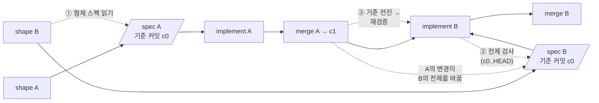

# 여러 스펙이 대기할 때 앞선 구현이 뒤 스펙을 무너뜨리는 문제

2026-09-10에 이 저장소의 파이프라인 결정과 최근 이력을 확인하고, 스펙 주도
개발 도구와 병렬 코딩 에이전트에 관한 1차 출처를 조사했다. 이 문서는 관찰
근거와 접근 후보를 보존한다. 확정된 결정은 아직 없으며, 셰이핑이 끝나면
같은 폴더의 `spec.md`가 계약이 된다. 여기 적힌 후보가 모두 채택되는 것은
아니다.

## 결론

문제는 서로 다른 두 가지다.

1. **순차 드리프트.** 스펙 B는 스펙 A가 아직 코드에 반영되기 전의 저장소를
   보고 쓰였다. A가 먼저 구현되면 B가 전제한 현재 동작, 문구, 파일 상태가
   바뀐다. 한 세션이 한 체크아웃에서 차례로 구현해도 생긴다.
2. **병렬 충돌.** A와 B를 워크트리 두 개에서 동시에 구현하면 같은 파일을
   고쳐 텍스트 충돌이 나고, 각자 통과한 검증이 합친 뒤에는 깨지는 의미
   충돌이 난다.

현재 파이프라인은 구현 계획을 구현 직전에 현재 코드에서 세우므로 "구현
예측"은 낡지 않는다. 낡는 것은 스펙이 기대는 **전제**다. 그 전제를 검사하는
단계가 없어서, 구현이 그 전제와 부딪힐 때에야 드러나고, 그때는 이미 문맥을
쓴 뒤다.

추천 방향은 다음 순서다. 새 산출물이나 중앙 로드맵 파일을 만들지 않고 기존
스펙 폴더와 스킬 안에서 해결한다.

- 스펙이 자신이 기준으로 삼은 커밋과, 거짓이 되면 계약이 달라지는 검증
  가능한 전제를 적는다.
- `implement`가 코드를 만지기 전에 그 전제를 현재 HEAD에서 검사하고, 깨진
  전제만 한정된 재셰이핑으로 돌려보낸다.
- 스펙을 출하하는 변경이 같은 PR에서 스펙 폴더를 퇴역시켜 `docs/specs/`가
  곧 "열린 스펙 집합"이 되게 한다.
- 그 위에서 `shape-idea`가 형제 열린 스펙을 읽고 관계를 적는다.
- 병렬 구현은 파이프라인 결정대로 별도로 선택하는 실행 모델로 두고, 선택할
  때 필요한 통합 순서와 재검증 규칙을 정한다.

## 조사 범위와 한계

- 저장소 근거는 `docs/decisions/pipeline.md`, `document-lifecycles.md`,
  `shape-idea.md`, `skill-design.md`, 여섯 개 워크플로 스킬 본문, 최근 열
  개 기능 커밋의 변경 파일, `docs/specs/` 아홉 개 폴더의 커밋 이력이다.
- 웹 조사는 두 개의 조사 에이전트가 1차 출처(공식 문서, README, 논문,
  이슈)를 직접 읽었다. 조사 중 웹 검색이 자주 불가능해 알려진 URL을 직접
  가져왔고, `openai.com`과 Medium은 403으로 읽지 못해 GitHub 원문과 2차
  보도로 대신했다. 본문에 인용한 핵심 수치와 문장은 이 세션에서 원문을 다시
  열어 확인했다.
- 사용자의 다른 프로젝트에서 실제로 드리프트가 난 세션 원문은 읽지 않았다.
  병렬 워크트리 세션을 쓴다는 것은 `docs/follow-ups/`와 이전 조사 문서에
  남은 `.claude/worktrees/`, `.claude-worktrees/` 경로로만 추정했다.
- 도구의 동작은 문서와 이슈로 확인한 것이지, 이 저장소에서 실행해 본 것이
  아니다.

## 이 저장소에서 관찰한 것

### 연속된 스펙이 같은 파일을 고친다

최근 열 개 기능 커밋(`c18e03c`부터 `3612325`까지)에서 두 개 이상이 고친
파일이다.

| 파일 | 고친 커밋 수 |
| --- | --- |
| `.claude-plugin/plugin.json` | 10 |
| `docs/decisions/pipeline.md` | 4 |
| `README.md` | 4 |
| `skills/workflow/implement/SKILL.md` | 3 |
| `skills/workflow/shape-idea/SKILL.md` | 3 |
| `docs/decisions/skill-design.md` | 3 |
| `docs/decisions/shape-idea.md` | 3 |

버전 범프 때문에 어떤 두 스펙을 병렬로 구현해도 `plugin.json`에서 반드시
텍스트 충돌이 난다. 결정 계약과 스킬 본문은 열에 셋, 넷이 겹친다. 이
저장소에서 스펙은 대개 "특정 파일의 특정 문장을 이렇게 바꾼다"를 인수
조건으로 적으므로, 앞선 스펙이 그 문장을 먼저 바꾸면 뒤 스펙의 인수 조건은
글자 그대로는 적용할 수 없게 된다.

### 스펙은 현재 상태를 전제로 인용한다

`docs/specs/handoff-reference-links/spec.md`의 확정 제약에는 "이 저장소의
여덟 개 스펙 중 결정 계약을 링크한 것이 없다", "아직 `tasks/` 폴더를 가진
스펙이 없다"가 근거로 적혀 있다. 이런 문장은 형제 스펙 하나가 먼저
구현되는 순간 거짓이 될 수 있고, 그 거짓이 계약을 바꾸는지 아닌지는 구현자가
스스로 판단해야 한다.

### 출하한 스펙 폴더가 남아 있다

| 폴더 | 스펙 커밋 | 구현 커밋 | 상태 |
| --- | --- | --- | --- |
| product-context-workflow | 2026-08-15 | 2026-08-15 | 출하, 잔존 |
| one-pass-review | 2026-08-19 | 2026-09-07 (#94) | 출하, 잔존 |
| expo-smoke-test | 2026-08-28 (#87) | 같은 PR | 출하, 잔존 |
| live-stack-context | 2026-08-28 (#86) | 같은 PR | 출하, 잔존 |
| active-implementation-verification | 2026-08-29 (#88) | 같은 PR | 출하, 잔존 |
| runtime-verification-preflight | 2026-08-31 | 2026-08-31 | 출하, 잔존 |
| writing-preferences | 2026-09-05 (#92) | 같은 PR | 출하, 잔존 |
| prototype-shell-theme-toggle | 2026-09-10 (#100) | 같은 PR | 출하, 잔존 |
| handoff-reference-links | 2026-09-10 (#101) | 같은 PR | 출하, 잔존 |

`document-lifecycles.md`는 출하하면 폴더를 지운다고 정하지만, 지우는 주체는
주기적인 `maintain-project-context`다. 그래서 `docs/specs/`만 봐서는 무엇이
열려 있는지 알 수 없다. 형제 스펙을 읽거나 순서를 정하는 어떤 접근도 이
신호 없이는 성립하지 않는다.

### 파이프라인이 이미 가진 것과 빠진 것

이미 있는 것:

- 구현 계획은 구현 직전에 현재 코드에서 세운다. 저장된 계획 파일은 거부됐다.
- 한 스펙 안에서는 결과 단위마다 관찰한 동작을 계약과 남은 작업에 대조하고,
  제품 계약을 바꿔야 하면 멈추고 셰이핑으로 돌려보낸다.
- 재사용할 결정은 결정 계약과 용어집으로 승격되고, `implement`는 스펙이
  링크한 계약을 필수 자료로 읽는다.
- `resolve-follow-ups`는 병렬 워커 모델을 이미 갖고 있다. 동시 실행 전에
  범위 독립성을 확인하고, 항목마다 워크트리와 PR을 분리하고, 워커를 셋으로
  제한하고, 자동 병합하지 않는다.
- 파이프라인 결정은 표준 작업을 순차로 두고, 병렬은 "별도로 선택하는 실행
  모델"로 남겨 두었다. 재검토 조건에 "순차 구현이 병목이 되고 사용자가
  독립적인 작업에 병렬 모델을 고른다"가 이미 있다.

빠진 것:

- `shape-idea`는 `PRODUCT.md`, 용어집, 결정 계약, 코드는 읽지만 다른 열린
  스펙은 읽지 않는다. 두 스펙이 같은 표면에 대해 다른 기능 지역 결정을
  내려도 보이지 않는다. 기능 지역 결정은 스펙에만 남기 때문이다.
- 스펙은 자신이 어떤 커밋을 보고 쓰였는지, 어떤 전제가 깨지면 계약이
  달라지는지 적지 않는다. 구현자는 불일치를 만나도 "세상이 바뀐 것"과
  "셰이핑이 틀린 것"을 구분할 근거가 없다.
- `implement`는 진행 상황은 재구성하지만 스펙의 전제를 검사하는 단계는
  없다.
- 검토 수리가 실행 동작을 바꾸면 이전 런타임 증거가 무효라는 규칙은 있지만,
  기준 브랜치에서 다른 커밋이 들어와도(리베이스, 형제 병합) 같은 취급을
  하는 규칙은 없다. 의미 충돌은 CI가 잡는 만큼만 잡힌다.
- 병렬 실행 모델은 의도적으로 비어 있다.

## 외부 조사

### 스펙 주도 개발 도구는 순차 드리프트를 어떻게 다루나

**OpenSpec** ([Fission-AI/OpenSpec](https://github.com/Fission-AI/OpenSpec),
1.13.0, 2026-09-09). 현재 진실인 `openspec/specs/`와 변경 제안
`openspec/changes/<name>/`을 나누고, 제안은 `ADDED`, `MODIFIED`, `REMOVED`
델타로 쓴다. 출하하면 `archive`가 델타를 진실에 합친다. 이것이 "앞선 변경이
뒤 변경의 전제를 바꾸는" 문제에 가장 직접 대응하는 설계다. 한계도 문서와
이슈에 그대로 있다.

- 델타는 작성 시점의 진실을 헤더 이름으로 복사한 스냅샷이다. `MODIFIED`는
  블록 전체 교체라서, 두 변경이 같은 요구를 고치면 "오래된 것 먼저, 새 것이
  덮어쓴다"([bulk-archive 스킬](https://raw.githubusercontent.com/Fission-AI/OpenSpec/main/skills/openspec-bulk-archive-change/SKILL.md)).
- [이슈 #1112](https://github.com/Fission-AI/OpenSpec/issues/1112)
  (2026-05-21, 열림): 변경 A가 만든 요구를 변경 B가 `MODIFIED`했는데 A의 PR은
  출하됐지만 A는 archive되지 않아 B의 archive가 몇 주 뒤 실패했다. 제안은
  검사를 archive 시점에서 작성 시점으로 옮기는 것이다.
- 변경 사이 의존을 적는 `dependsOn`, `touches`, `change next`
  제안(`add-change-stacking-awareness`)은 2026-02-21 이후 미구현이다. 그
  사이에는 `IMPLEMENTATION_ORDER.md`라는 서술형 순서 파일을 쓴다.
- 2차 논평: "대기 중인 변경의 절반이 몇 달 전에 출하된 저장소를 봤다".
  archive 규율이 사람 손에 달려 있어서다. 이 저장소의 잔존 폴더와 같은
  현상이다.

**GitHub spec-kit** ([github/spec-kit](https://github.com/github/spec-kit),
1.0.0, 2026-08-21). 기능마다 `specs/NNN-name/`을 만들고 constitution만
공유한다. `converge`는 구현 시점에 spec, plan, tasks를 현재 코드와 대조해
missing, partial, **contradicts**, unrequested로 분류하지만 스펙을 고치지는
않는다. `analyze`는 한 기능 폴더 안만 본다. 앞선 기능이 뒤 기능을 낡게 만드는
[이슈 #620](https://github.com/github/spec-kit/issues/620) (2025-09-27)은
답이 없다. 커뮤니티 확장이 그 자리를 메운다. Spec Orchestrator는 tasks의
파일 경로 겹침을 보고 "001을 먼저 병합하고 004를 리베이스하라"고 권하고,
Archive Extension은 병합 뒤 스펙을 메모리로 접어 넣고, Intake Sequencing은
기능 사이의 타입 있는 의존 그래프와 `next`를 준다.

**Kiro** ([kiro.dev/docs/specs](https://kiro.dev/docs/specs/)). 스펙마다
requirements, design, tasks를 두고, 코드가 바깥에서 바뀌면 "Sync Files"로
완료된 작업을 다시 표시한다. 2026-01부터 tasks의 의존 그래프로 wave를 만들어
병렬 실행한다. [이슈 #8402](https://github.com/kirodotdev/Kiro/issues/8402)
(2026-05-11, not planned로 닫힘): 한 체크아웃에서 병렬 실행하니 빌드와
테스트가 서로를 죽였고, 완료 상태가 `tasks.md`에 늦게 쓰여 다른 에이전트가
같은 작업을 다시 했다. 이 저장소의 태스크 파일도 같은 위험을 가진다.

**BMAD** ([bmad-code-org/BMAD-METHOD](https://github.com/bmad-code-org/BMAD-METHOD)).
다음 스토리를 계획할 때 같은 에픽에서 완료된 이전 스토리의 코드 맵, 설계
노트, 변경 로그를 읽는다. 사람이 승인한 의도 부분은 동결하고 나머지는
이유를 남기며 고친다. 중간에 큰 변경이 생기면 `correct-course`로 영향을
평가하고 가장 이른 영향 지점부터 다시 시작한다. "끝난 일은 끝난 것으로
둔다".

**한 번에 하나.** Ralph 루프(2025-07-14)는 `specs/*`만 고정하고 계획 파일은
루프마다 다시 만든다. Kent Beck(2025-06-25)은 `plan.md`의 다음 테스트
하나만 구현한다. GSD는 한 단계씩만 계획한다. Claude Code 모범 사례는
"스펙이 끝나면 새 세션에서 실행"하고 "한 문장으로 diff를 설명할 수 있으면
계획을 건너뛴다".

**분류와 비판.** Böckeler(2025-10-15,
[martinfowler.com](https://martinfowler.com/articles/exploring-gen-ai/sdd-3-tools.html))는
spec-first, spec-anchored, spec-as-source로 나누고 "여러 진화하는 스펙을
조율하는 지침이 거의 없다"고 적었다. Thoughtworks Radar(2025-11-05)는
Assess에 두었다. 고전에서는 baseline과 변경 통제, PEP와 RFC의 "수락 뒤에는
수정하지 않고 superseded로 표시", 롤링 웨이브 계획이 같은 문제를 다룬다.

### 병렬 에이전트는 충돌을 어떻게 다루나

**Claude Code** ([worktrees](https://code.claude.com/docs/en/worktrees),
[agent teams](https://code.claude.com/docs/en/agent-teams),
[cross-session messaging](https://code.claude.com/docs/en/cross-session-messaging)).
워크트리 격리는 도구가 강제한다. 메인 체크아웃으로 향하는 편집, 명령, git
리다이렉트를 막는다. 에이전트 팀은 공유 작업 목록에 의존을 두고 파일 잠금으로
claim하지만, 팀원은 워크트리로 격리되지 않으므로 "팀원마다 다른 파일 집합을
소유하라"고 하고, "순차 작업, 같은 파일 편집, 의존이 많은 작업에는 단일
세션이 낫다"고 적는다. 알려진 한계: "완료 표시가 늦어 의존 작업이 막힌다".
세션 간 메시지는 "한 세션의 변경이 다른 세션이 기대는 것을 깨뜨릴 때 미리
경고"하고 "워크트리 세션끼리 무엇이 반영됐는지 알리는" 용도로 설계됐다.
`/batch`는 5에서 30개의 독립 단위를 가정한다.

**OpenAI Codex와 Symphony** ([openai/symphony](https://github.com/openai/symphony),
2026-04). 이슈마다 워크스페이스 하나, 상태 머신은 Linear의 상태다.
`blocked_by`는 "best-effort 메타데이터"로 강제하지 않는다. 재작업은
워크트리와 PR을 버리고 처음부터 다시 한다. 모델이 병합 충돌을 잘 풀어서
"충돌은 거의 신경 쓰지 않는다"는 것이 설계자의 말이다.

**Anthropic의 병렬 컴파일러 실험**
([Building a C compiler](https://www.anthropic.com/engineering/building-c-compiler),
2026-02-05). 컨테이너 16개, 작업 잠금은 `current_tasks/` 텍스트 파일과 git
push 경쟁, 통합은 평범한 git merge. "충돌은 잦지만 풀 수 있다". 실패는
"기존 기능을 반복해서 깨뜨림"과 "16개가 같은 버그로 수렴"이었고, 테스트가
실제 스펙 역할을 했다.

**연구.**

- CAID ([arXiv 2603.21489](https://arxiv.org/abs/2603.21489), 2026-03,
  Geng와 Neubig): 중앙 관리자가 의존 DAG를 세우고 병합 뒤마다 갱신하며, 각
  엔지니어는 워크트리에서 일하고 충돌을 낸 쪽이 main을 당겨 풀고 다시 낸다.
  PaperBench에서 워크트리 격리 63.3%, 공유 작업 공간 55.5%, 단일 에이전트
  57.2%. Commit0에서 엔지니어 2에서 4로 늘리면 오르고 8이면 내린다.
- PlanFence ([arXiv 2609.03340](https://arxiv.org/abs/2609.03340), 2026-09-03):
  "계획이 기댄 기록을 계획이 인용하고, 실행자는 보류 중인 행동에 영향을 줄 수
  있는 기록만 검사한 뒤 한 번 재계획하거나 막는다". 공유 상태가 최신인 것만
  확인하는 실행자는 30개 워크플로 전부에서 낡은 계획을 실행했다. 이 저장소의
  "스펙 전제 검사"와 같은 구조다.
- GitHub 에이전트 PR 연구 ([arXiv 2607.04697](https://arxiv.org/abs/2607.04697),
  2026-07): 2,807개 저장소에서 동시 PR 쌍의 텍스트 충돌률은 같은 에이전트
  19.8%, 다른 에이전트 41.7%. 정확히 겹치는 동시 PR을 가진 저장소가 40.2%.
- Cognition "Don't Build Multi-Agents"(2025-06-12): "행동은 암묵적 결정을
  담고, 충돌하는 결정은 나쁜 결과를 낳는다". 스펙 A의 구현이 내린 이름,
  구조, 문구 결정을 스펙 B가 다르게 내리는 것이 바로 이 경우다.
- Merge debt(2026-07-30), Augment(2026-03-16): 생성은 병렬이 됐는데 통합은
  직렬이라 "끝났지만 안 들어간 코드"가 쌓인다. 라우팅 테이블, 설정, 레지스트리
  같은 핫스팟 파일이 충돌 지점이다. 하나 병합할 때마다 나머지 브랜치를 전부
  리베이스한다.

### 패턴 정리

| 패턴 | 쓰는 곳 | 약점 | 이 저장소에 이미 있나 |
| --- | --- | --- | --- |
| 워커마다 파일 시스템 격리, 사람이 순서대로 통합 | Claude Code worktree, Codex cloud, Cursor, Devin, CAID | 충돌을 병합 시점으로 미룰 뿐이다. 의미 충돌은 CI가 보는 만큼만 잡힌다 | `resolve-follow-ups`에 있음 |
| 파일 소유로 정적 분할 | agent teams, Devin workflows, `/batch` | 핫스팟 파일은 나눌 수 없다. 인터페이스 변경은 경계를 넘는다 | 없음. 이 저장소의 핫스팟은 `plugin.json`, 결정 계약 |
| 의존 그래프와 ready 집합 | Beads, Task Master, Kiro waves, CAID, agent teams | 완료 표시가 늦거나 빠지면 막히거나 중복된다 | 한 스펙 안 태스크에만 있음 |
| 델타를 살아 있는 진실에 합침 | OpenSpec, spec-kit Archive 확장 | 스냅샷 기반이라 형제가 먼저 바꾸면 대상이 없거나 덮어쓴다 | 결정 계약과 용어집이 재사용 결정에 한해 이 역할 |
| 구현 시작 시 현재 상태 재검증 | spec-kit converge, Kiro Sync, PlanFence, Ralph | 에이전트가 알아채는 데 의존한다. 스펙 본문은 그대로 남는다 | 없음 |
| 병합 큐, 병합마다 리베이스와 게이트 | Gas Town Refinery, Graphite, Bernstein | 직렬 지점이 처리량을 제한한다. 게이트는 테스트가 표현하는 것만 잡는다 | `merge` 스킬은 required checks만 존중 |
| 한 번에 하나, 적시 상세화 | Ralph, Beck, GSD, 롤링 웨이브 | 병렬 이득이 없다. 스펙을 묶어 미리 검토할 수 없다 | 표준 작업 모델 |
| 저장소가 진실, 기계적 검사, 주기적 재생성 | OpenAI harness, DeepWiki, 살아 있는 문서 | 린트와 테스트로 표현되는 불변식만 지킨다 | `maintain-project-context`가 주기 위생 |

문서로 확인한 어떤 도구도 앞선 스펙이 반영됐을 때 뒤 스펙의 **본문**을
다시 기준에 맞춰 주지 않는다. 가장 가까운 것은 OpenSpec의 validate와
archive(감지만), spec-kit converge(코드와 모순 감지, 작업 추가), 커뮤니티
확장의 LLM 의미 병합이다. 전제가 낡는 것을 **예방**하는 것은 순서 정하기와
적시 상세화뿐이고, 둘 다 강제 도구가 아니라 규율이다.

## 접근 후보

개입 지점은 셋이다.

### 1. 기준 커밋과 전제를 스펙에 적고, 구현 시작 시 검사한다

`shape-idea`가 `spec.md`에 기준 커밋과, 거짓이 되면 계약이 달라지는 전제
몇 개를 적는다. 전제는 검사할 수 있게 쓴다("`implement` 본문에 리뷰어
범위를 대조하는 문장이 없다"처럼). `implement`는 첫 결과를 고르기 전에
전제를 현재 HEAD에서 검사하고, 기준 커밋 이후 스펙이 고치려는 표면에 닿은
커밋 목록을 보고 그 표면을 다시 읽는다. 깨진 전제는 그 전제가 지지하는
결과만 막고 한정된 재셰이핑으로 보낸다. 나머지는 계속한다.

- 근거: PlanFence의 의존 범위 검증, `resolve-follow-ups`의 "편집 전에 증상
  재현" 게이트와 같은 구조. spec-kit converge가 하는 일을 스펙 폴더 안에서
  한다.
- 약점: 셰이퍼가 전제를 예견해야 한다. 코드에서만 드러나는 드리프트는 커밋
  목록 대조가 보완한다. 스펙 폴더에 새 필드가 생기는 것은 제품 계약 열거를
  바꾸지 않도록 링크처럼 옆에 두는 방식을 검토해야 한다.

### 2. 스펙을 출하하는 변경이 폴더를 퇴역시킨다

스펙의 마지막 결과가 병합되는 PR이 재사용할 결정을 계약으로 승격한 뒤
`docs/specs/<slug>/`를 지운다. `maintain-project-context`는 놓친 것을
줍는 역할로 남는다.

- 근거: 아홉 폴더 모두 출하 뒤 잔존. OpenSpec 사용자의 "절반이 몇 달
  전 출하" 관찰과 같다. 후보 3과 6은 이것 없이 성립하지 않는다.
- 약점: 여러 PR에 걸쳐 출하되는 스펙은 "마지막" 판단이 필요하다. 어느
  스킬이 지우는지(`implement`, `merge`, 둘 다) 정해야 한다.

### 3. 셰이핑이 형제 열린 스펙을 읽고 관계를 스펙 안에 적는다

`shape-idea`가 `docs/specs/*/spec.md`를 증거로 읽고, 새 스펙에 "앞서야
하는 스펙과 이유", "같은 표면을 만지는 스펙", "독립"을 적는다. 순서는
각 스펙이 적은 관계에서 읽어 내고 중앙 파일은 두지 않는다.

- 근거: 태스크 파일이 blocker를 인라인으로 적는 것과 같은 방식. 파이프라인이
  거부한 "별도 로드맵이나 실행 원장"을 만들지 않는다. 두 스펙이 같은 표면에
  다른 결정을 내리는 것을 셰이핑 시점에 잡는다.
- 약점: 열린 스펙이 많으면 읽기 비용이 커진다. 관계는 명시한 것만 보인다.

### 4. 형제 스펙이 만질 표면에 대한 결정은 즉시 결정 계약으로 승격한다

프로젝트 결정 게이트의 "재사용" 조건에 "다른 열린 스펙이 같은 표면을
만진다"를 포함시킨다. 그러면 스펙 A가 내린 결정을 스펙 B의 `implement`가
필수 자료로 읽는다.

- 근거: OpenSpec의 살아 있는 진실을 새 산출물 없이 기존 결정 계약으로
  얻는다. Cognition이 말한 암묵적 결정을 명시적 결정으로 바꾼다.
- 약점: 결정 계약 편집이 늘고, 결정 계약 자체가 핫스팟 파일이 된다(이미
  `pipeline.md`가 열에 넷).

### 5. 뒤 스펙은 거칠게 두고 구현 직전에 상세화한다

여러 스펙을 한 번에 셰이핑하되, 앞선 스펙이 반영되기 전에는 결과와 범위만
확정하고 인수 조건과 제약은 구현 직전에 완성한다.

- 근거: 롤링 웨이브, Scrum 백로그 상세화, "한 번에 하나" 계열. 전제가 낡는
  것을 예방한다.
- 약점: 스펙 묶음을 미리 완전하게 검토하는 이점을 포기한다. 현재 셰이핑
  스킬의 완료 조건("구현 관련 결정이 모두 해결되거나 명시적으로 유예")과
  충돌해 별도 상태가 필요하다.

### 6. 병렬 실행 모델을 명시적으로 정의한다

사용자가 병렬을 고를 때만 적용한다. 스펙마다 워크트리 하나, 시작 전에
후보 3의 관계와 스펙이 만질 표면으로 독립성을 확인하고, 동시 실행은 셋
이하로 제한하고, 통합은 정한 순서로 하나씩 한다. 하나가 병합되면 남은
브랜치는 리베이스한 뒤 후보 1의 전제 검사와 런타임 검증을 다시 한다(검토
수리가 런타임 증거를 무효화한다는 기존 규칙을 기준 브랜치 전진에도
적용). 버전 범프, README, 결정 계약 같은 핫스팟 파일은 통합 시점에 통합자가
고치거나 충돌을 예상하고 푼다. 워크트리 세션끼리는 Claude Code의 세션 간
메시지로 "무엇이 반영됐는지"를 알린다.

- 근거: CAID의 격리와 병합 뒤 DAG 갱신, Merge debt의 "병합마다 리베이스",
  `resolve-follow-ups`의 기존 워커 모델, agent teams 문서의 "같은 파일을
  고치는 작업은 단일 세션".
- 약점: 통합 순서의 주인이 필요하다. 이 저장소에서는 병렬 PR이 항상
  `plugin.json`에서 충돌한다. 파이프라인 결정의 재검토 조건("병목이고
  사용자가 병렬을 고른다")이 실제로 성립하는지 먼저 확인해야 한다.

## 결정이 필요한 것

1. 표준 실행 모델. 순차 구현을 표준으로 두고 후보 1, 2, 3을 먼저 넣을지,
   병렬(후보 6)까지 지금 정의할지. 추천은 순차 표준에 후보 1과 2를 먼저
   넣는 것이다. 근거 대부분이 병렬의 이득이 넷을 넘으면 사라지고 통합 부채가
   지배한다고 말한다.
2. 전제와 관계를 `spec.md`의 어디에 두는지. 제품 계약 여덟 필드의 열거를
   바꾸지 않으려면 링크처럼 옆에 두는 방식이 있다.
3. 폴더 퇴역의 주인. `implement`의 마지막 결과 완료 시점인지, `merge`가
   병합 뒤 정리하는 시점인지.
4. 전제 검사가 실패했을 때 재셰이핑의 범위. 깨진 전제가 지지하는 결과만
   막고 나머지는 진행하는지, 스펙 전체를 다시 여는지.
5. 병렬을 정의한다면 핫스팟 파일 처리와 통합 순서의 주인.
